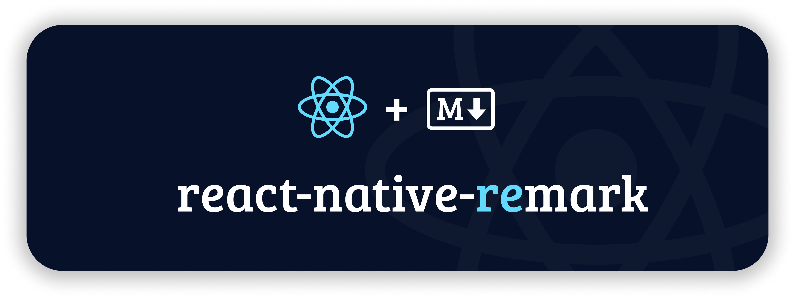
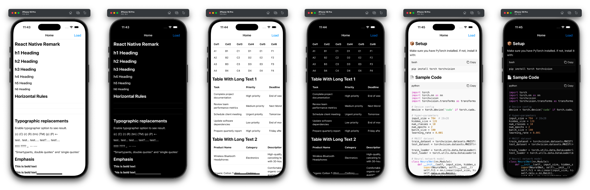

<p align="center">
  <a href="https://github.com/imwithye/react-native-remark/actions/workflows/build.yml">
    <picture>
      
    </picture>
  </a>
  <a href="https://www.npmjs.com/package/react-native-remark">
    <picture>
      
    </picture>
  </a>
  <a href="https://www.npmjs.com/package/react-native-remark">
    <picture>
      
    </picture>
  </a>
  <a href="https://www.npmjs.com/package/react-native-remark">
    <picture>
      
    </picture>
  </a>
  <a href="https://github.com/imwithye/react-native-remark/blob/main/LICENSE">
    <picture>
      
    </picture>
  </a>
</p>

**react-native-remark** provides elegant and powerful Markdown rendering capabilities for React Native applications.

## Features

- 📱 Render Markdown in React Native applications
- 🎯 Supports **GitHub Flavored Markdown (GFM)**
- 🌈 Syntax highlighting for code blocks
- 📊 Table rendering with horizontal scroll view
- 🖼️ Inline and block image rendering
- 🌙 Dark Mode support
- ⚙️ Custom renderers and styles for flexible UI customization

## Installation

```sh
npm install react-native-remark
```

## Usage

```jsx
import { Markdown } from "react-native-remark";

const markdown = `
# Hello World! 👋

This is a **Markdown** example with [a link](https://reactnative.dev).

- List item 1
- List item 2
`;

export default function App() {
  return (
     <Markdown
        markdown={markdown}
        customRenderers={{
            // Override default renderers for mdast nodes.
            // Checkout https://github.com/imwithye/react-native-remark/blob/main/src/renderers/index.tsx
            // for the default renderers.
            InlineCodeRenderer: ({ node }) => (
              <Text style={{ color: "blue" }}>{node.value}</Text>
            ),
            ThematicBreakRenderer: () => (
              <View style={{ height: 5, backgroundColor: "red" }} />
            ),
        }}
        customStyles={{
            // Override default styles
            // Checkout https://github.com/imwithye/react-native-remark/blob/main/src/themes/default.tsx
            // for the default styles.
            inlineCode: {
              color: "red",
            },
            text: {
              color: "red",
            },
        }}
        onCodeCopy={(code) => Clipboard.setStringAsync(code)}
        onLinkPress={(url) => Linking.openURL(url)}
      />
  );
}
```

## Supported Custom Renderers

All `mdast` node types have corresponding renderers, and each renderer can be fully customized. A renderer receives the following props:

```javascript
// The current mdast node
node: any;

// The parent node, if it exists
parent?: Node;

// The index of this node within the parent's children
index?: number;
```

Checkout [renderers](./src/renderers/) for the default implementations. To ensure type safety when creating custom renderers, you can use the `RendererArgs<MdastType>` props interface.

## Supported Themes

Themes are pre-defined style collections that provide consistent visual styling for markdown content. Currently, we support two built-in themes: 1. default, and 2. serif. To use a theme, you can follow this pattern:

```js
import { themes } from "react-native-remark"
const { serifTheme } = themes;

// Thene you can use it with
<Markdown theme={serifTheme} ... />
```

Custom styles will override the selected theme's default styles.

## Supported Custom Styles

Checkout [default.tsx](./src/themes/default.tsx) for default styles.

| Style Key         | Description                           | Example Markdown Element      |
|-------------------|---------------------------------------|-------------------------------|
| `blockquote`      | Styles for blockquotes                | `> This is a blockquote`      |
| `borderColor`     | Default border color used globally    | Borders, thematic breaks      |
| `break`           | Line break styling (empty by default) | Line breaks                   |
| `codeBlock`       | Styles for code blocks                | ```code``` blocks             |
| `container`       | Container layout spacing              | Root container layout         |
| `delete`          | Deleted text style                    | ~~strikethrough~~ text        |
| `emphasis`        | Italic text style                     | *italic* or _italic_          |
| `footnoteReference` | Style for footnote references       | Footnote markers              |
| `heading`         | Heading styles (h1, h2, h3...)        | # Heading                     |
| `image`           | Image styling                         | Inline or block images        |
| `inlineCode`      | Inline code styling                   | `inline code`                 |
| `link`            | Link styling                          | [link](url)                   |
| `linkReference`   | Reference-style links                 | [reference][id]               |
| `list`            | List container styling                | Lists (`- item` or `1. item`) |
| `listItem`        | List item styling                     | Each list item                |
| `paragraph`       | Paragraph text styling                | Normal paragraphs             |
| `strong`          | Bold text style                       | **bold**                      |
| `tableCell`       | Table cell text styling               | Table cell contents           |
| `text`            | General text style                    | Plain text                    |
| `thematicBreak`   | Horizontal rule styling               | ---                           |

## Quick Look



## Contribute

See [`CONTRIBUTING.md`](./CONTRIBUTING.md) for ways to get started.

This project has a [CODE OF CONDUCT](./CODE_OF_CONDUCT.md).
By interacting with this repository, organization, or community you agree to abide by its terms.

## Star History

<a href="https://www.star-history.com/#imwithye/react-native-remark&Date">
 <picture>
   <source media="(prefers-color-scheme: dark)" srcset="https://api.star-history.com/svg?repos=imwithye/react-native-remark&type=Date&theme=dark" />
   <source media="(prefers-color-scheme: light)" srcset="https://api.star-history.com/svg?repos=imwithye/react-native-remark&type=Date" />
   
 </picture>
</a>

