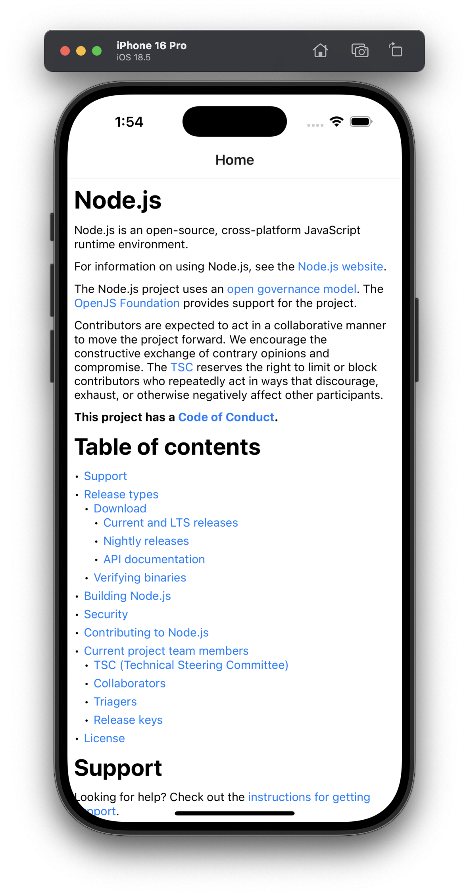

# react-native-remark

**react-native-remark** provides elegant and powerful Markdown rendering capabilities for React Native applications.



## Features

* Render Markdown in React Native applications
* Supports GitHub Flavored Markdown (GFM)
* Allows custom renderers for flexible UI customization

## Installation

```sh
npm install react-native-remark
```

## Usage

```jsx
import React from "react";
import { Markdown } from "react-native-remark";

const markdown = `
# Hello World! 👋

This is a **Markdown** example with [a link](https://reactnative.dev).

- List item 1
- List item 2
`;

export default function App() {
  return (
     <Markdown
        markdown={markdown}
        customRenderers={{
            // Override default renderers for mdast nodes.
            ...
        }}
        onLinkPress={(url) => Linking.openURL(url)}
      />
  );
}
```

## Development

```
pnpm i
cd example && pnpm i && pnpm run ios
```
