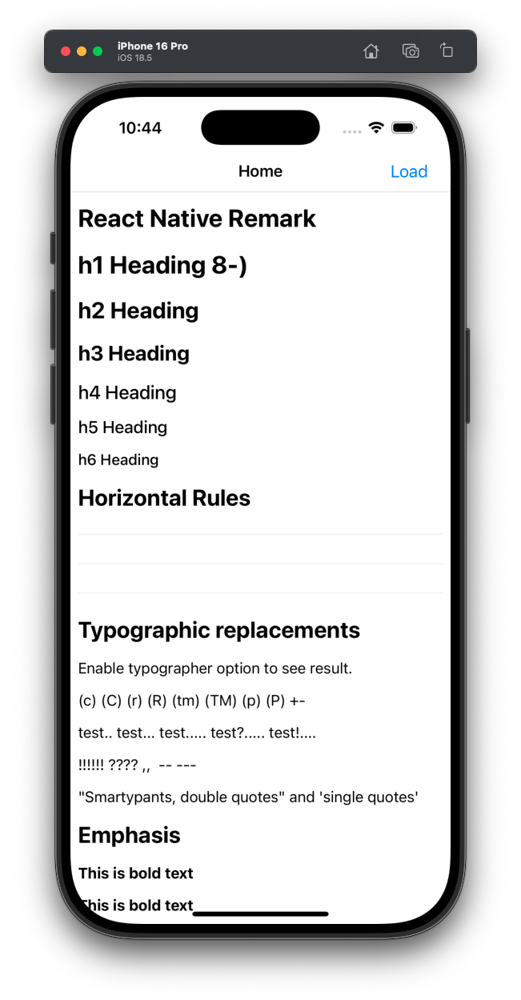
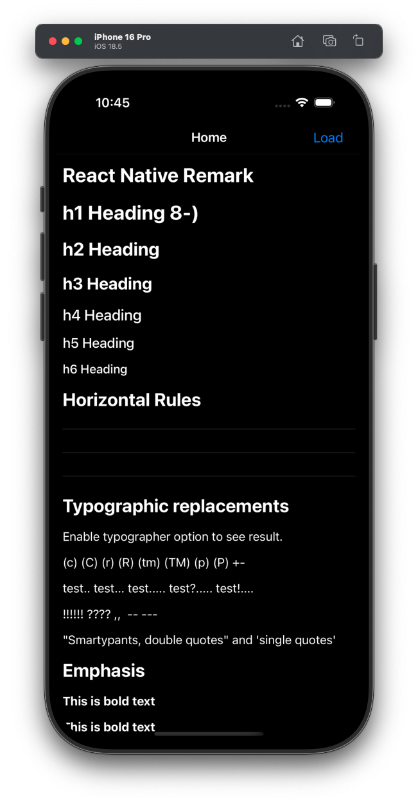
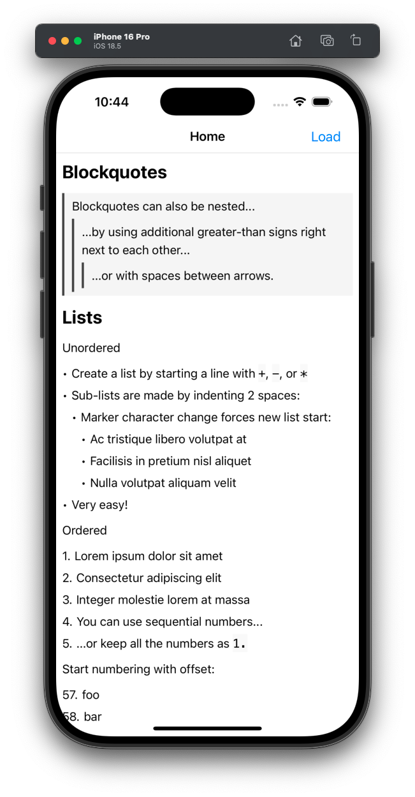
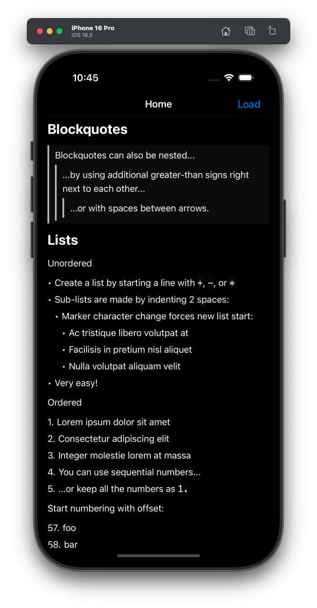
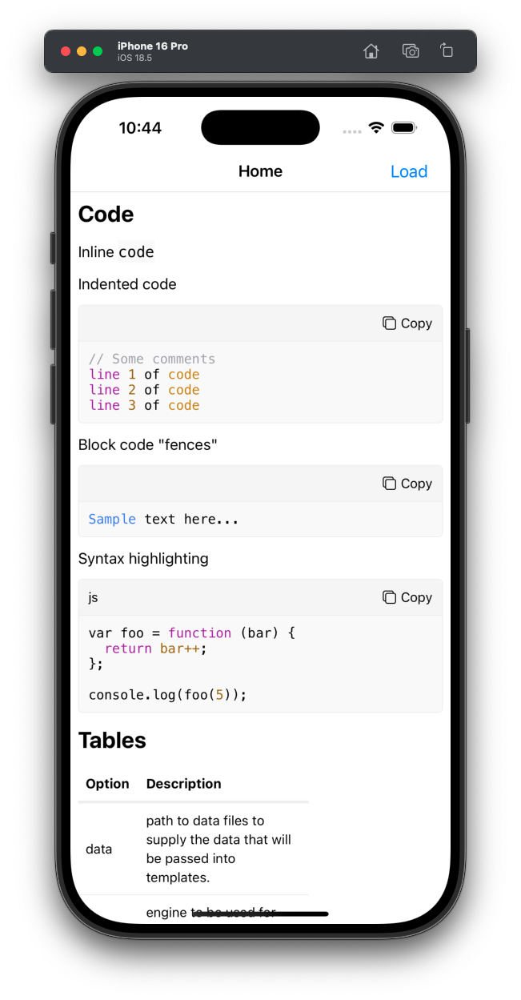
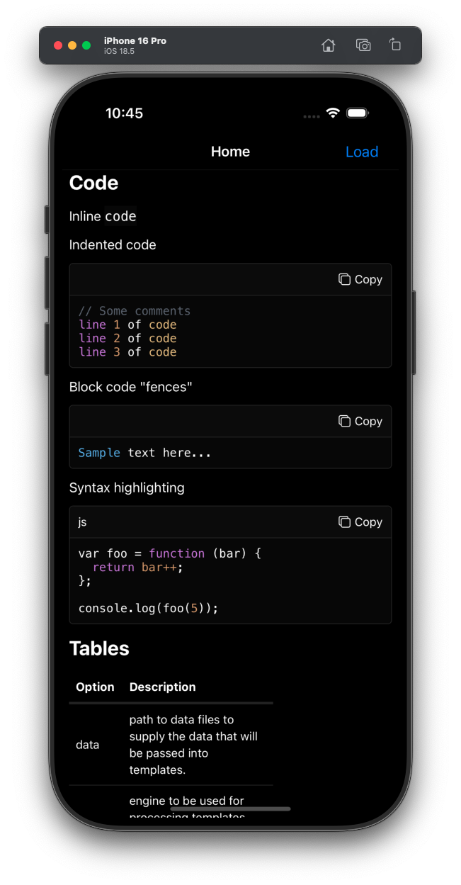
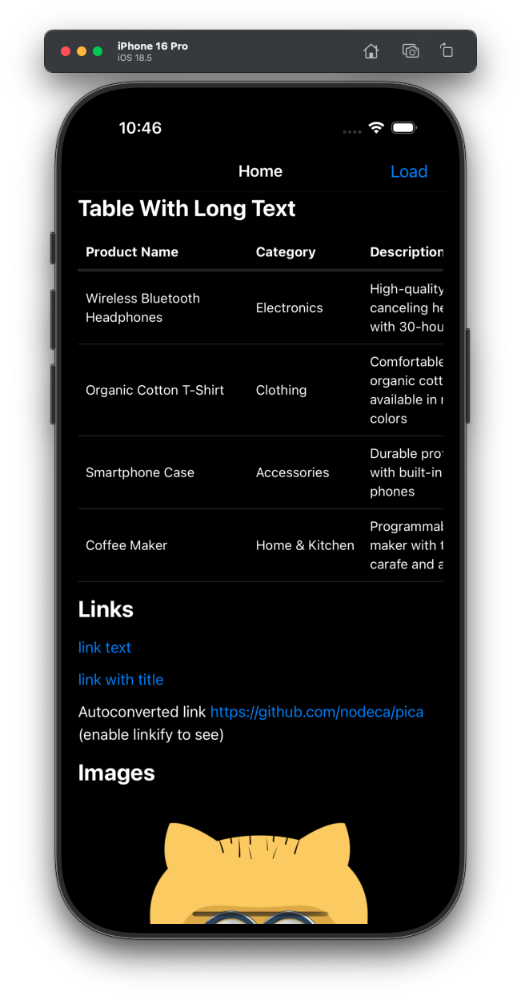

<p align="center">
  <a href="https://github.com/imwithye/react-native-remark/actions/workflows/build.yml">
    <picture>
      
    </picture>
  </a>
  <a href="https://www.npmjs.com/package/react-native-remark">
    <picture>
      
    </picture>
  </a>
  <a href="https://www.npmjs.com/package/react-native-remark">
    <picture>
      
    </picture>
  </a>
  <a href="https://www.npmjs.com/package/react-native-remark">
    <picture>
      
    </picture>
  </a>
  <a href="https://github.com/imwithye/react-native-remark/blob/main/LICENSE">
    <picture>
      
    </picture>
  </a>
</p>

**react-native-remark** provides elegant and powerful Markdown rendering capabilities for React Native applications.

## Features

- 📱 Render Markdown in React Native applications
- 🎯 Supports GitHub Flavored Markdown (GFM)
- 🌈 Syntax highlighting for code blocks
- 📊 Table rendering with horizontal scroll view
- 🖼️ Inline and block image rendering
- 🌙 Dark Mode support
- ⚙️ Custom renderers and styles for flexible UI customization

## Installation

```sh
npm install react-native-remark
```

## Usage

```jsx
import React from "react";
import { Markdown } from "react-native-remark";

const markdown = `
# Hello World! 👋

This is a **Markdown** example with [a link](https://reactnative.dev).

- List item 1
- List item 2
`;

export default function App() {
  return (
     <Markdown
        markdown={markdown}
        customRenderers={{
            // Override default renderers for mdast nodes.
            // Checkout https://github.com/imwithye/react-native-remark/blob/main/src/renderers/index.tsx
            // for the default renderers.
            ...
        }}
        customStyles={{
            // Override default styles
            // Checkout https://github.com/imwithye/react-native-remark/blob/main/src/themes/default.tsx
            // for the default styles.
            ...
        }}
        onCodeCopy={(code) => Clipboard.setStringAsync(code)}
        onLinkPress={(url) => Linking.openURL(url)}
      />
  );
}
```

## Quick Look

### Heading

 

### List

 

### Code Block

 

### Table Block

 

## Development

```
pnpm i
cd example && pnpm i && pnpm run ios
```

## Star History

<a href="https://www.star-history.com/#imwithye/react-native-remark&Date">
 <picture>
   <source media="(prefers-color-scheme: dark)" srcset="https://api.star-history.com/svg?repos=imwithye/react-native-remark&type=Date&theme=dark" />
   <source media="(prefers-color-scheme: light)" srcset="https://api.star-history.com/svg?repos=imwithye/react-native-remark&type=Date" />
   
 </picture>
</a>

